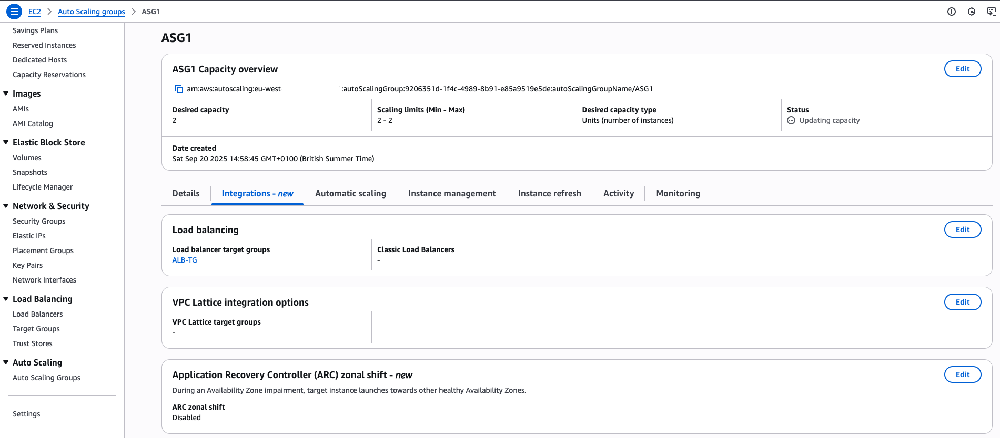
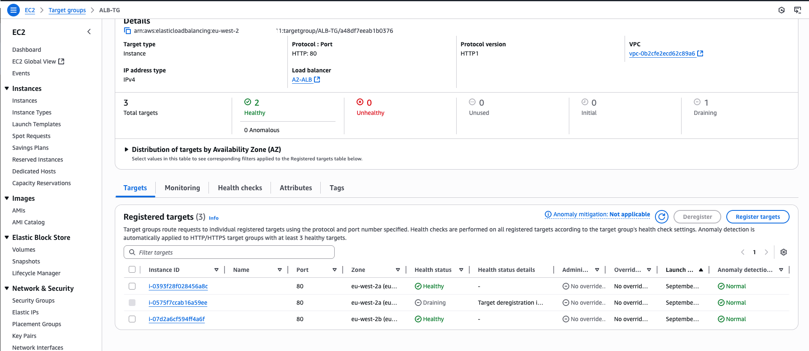

# AWS Networking Project: Application Load Balancer with Auto Scaling & Private Subnets 

  

## Introduction   

This project demonstrates the deployment of a **highly available, secure, and scalable architecture** on AWS.   

  

The goal was to:   

- Launch two EC2 instances in **private subnets**,   

- Place them behind an **Application Load Balancer (ALB)**,   

- Use **Auto Scaling** for redundancy and resilience,   

- Secure the environment with properly designed **security groups**,   

- Integrate **Cloudflare DNS** with an **ACM SSL certificate** for HTTPS access.   

  

To test how everything worked, I also deployed a **Bastion host** for secure SSH access and private subnet testing.   

  

--- 

  

## Architecture Overview   

*High-level architecture showing VPC, subnets, route tables, Internet Gateway, NAT Gateways, Application Load Balancer, EC2 instances, and Security Groups.*  

 

   

 

**Components deployed:**   

- Custom VPC with CIDR block `10.0.0.0/16`   

- Two **public subnets** for ALB + NAT Gateways   

- Two **private subnets** for EC2 instances   

- **Internet Gateway** attached to the VPC   

- **NAT Gateways** in both AZs for outbound internet access from private subnets   

- **Application Load Balancer** distributing traffic across two EC2s   

- **Auto Scaling Group** maintaining redundancy and resilience   

- **Cloudflare DNS + ACM SSL certificate** providing secure HTTPS for `kamranr.com`   

- **Bastion host** (for testing only)   

  

--- 

  

## Step-by-Step Build   

  

### Step 1 – VPC and Subnets   

- Created a **custom VPC** with CIDR block `10.0.0.0/16`.   

- Provisioned:   

  - `PublicSubnetA` (10.0.1.0/24) in `eu-west-2a`   

  - `PublicSubnetB` (10.0.2.0/24) in `eu-west-2b`   

 

  - `PrivateSubnetA` (10.0.3.0/24) in `eu-west-2a`   

  - `PrivateSubnetB` (10.0.4.0/24) in `eu-west-2b`   

  

   

  

**Reasoning:** Non-overlapping CIDR ranges allowed deployment across two AZs for high availability.   

  

--- 

  

### Step 2 – Internet Gateway and Route Tables   

- Attached an **Internet Gateway** to the VPC.   

- Configured route tables:   

  - **PublicRouteTable** → `0.0.0.0/0` via IGW   

  - **PrivateRouteTableA** → `0.0.0.0/0` via NATGW-A   

  - **PrivateRouteTableB** → `0.0.0.0/0` via NATGW-B   

  


   

   

  

*Reasoning:** Ensures public resources route through IGW while private EC2s use NAT for outbound internet.   

  

--- 

  

### Step 3 – NAT Gateways   

- Deployed **NATGW-A** in `PublicSubnetA`.   

- Deployed **NATGW-B** in `PublicSubnetB`.   

- Updated private route tables to send `0.0.0.0/0` via their local NAT.   

  

   

   

  

*Reasoning:** Each AZ uses its own NAT → avoids cross-AZ data charges and improves resilience.   

  

--- 

  

### Step 4 – Security Groups   

 

- **ALB SG (LB-SG):**   

  - Inbound: 80/443 from `0.0.0.0/0`   

  - Outbound: all traffic   

 

- **Web SG (web-sg):**   

  - Inbound: 80 from ALB SG only   

  - Outbound: all traffic   

  

   

   

  

 

**Reasoning:** EC2s are never directly reachable from the internet — all traffic must flow through ALB.   

  

--- 

  

### Step 5 – Launch Template & Auto Scaling Group   

- Created a **Launch Template** with:   

  - Amazon Linux 2 AMI   

  - Instance type: `t2.micro`   

  - Security group: `web-sg`   

  - User data script:   

  


   


  

**User Data Script**:   

```bash 
#!/bin/bash 

yum update -y 

yum install -y httpd 

systemctl start httpd 

systemctl enable httpd 

echo "<h1>Hello Kamran from $(hostname -f) </h1>" > /var/www/html/index.html``` 

``` 

Configured an **Auto Scaling Group**:   

  - Desired capacity = 2   

  - Subnets = `PrivateSubnetA` and `PrivateSubnetB`   

  - Attached to ALB target group   

  

**Reasoning:** ASG ensures at least 2 healthy instances across AZs.   

  

--- 

  

### Step 6 – Application Load Balancer   

  

- Deployed **internet-facing ALB** across both public subnets.   

- Configured listeners:   

  - HTTP (80) → redirect to HTTPS (443)   

  - HTTPS (443) → forward to target group (`ALB-TG`)   

 

The target group (ALB-TG) was configured to perform health checks on "/" - the root of the web server. 

  


   

 

**Reasoning:** ALB provides fault tolerance + HTTPS termination.   

  

--- 

  

### Step 7 – HTTPS with ACM and Cloudflare   

  

- Requested an **ACM certificate** for `kamranr.com`.   

- Validated via DNS (added CNAME record in Cloudflare).   

- Attached certificate to ALB HTTPS listener.   

- In Cloudflare:   

  - Created CNAME for `kamranr.com` → ALB DNS hostname.   

  - Set SSL/TLS mode = *Full (Strict)*.   

 

   

   

   

 

**Hurdles:**   

- Initial **NXDOMAIN** errors due to DNS cache → fixed by updating nameservers + flushing DNS.   

- Direct ALB DNS failed with cert mismatch → expected (cert only covers `kamranr.com`).   

  

--- 

  

## Testing with Bastion Host   

 

To test how everything worked, I deployed a **Bastion host** in `PublicSubnetA`, allowed SSH only from my IP, and permitted SSH from  

`bastion-sg` → `web-sg`.  

From my laptop I connected to the Bastion (public IP) and then into the private EC2s (private IPs).   

Once inside the private instances, I verified outbound internet access via the NAT Gateways by running: 

curl -I https://www.google.com  

ping google.com  

Both succeeded → confirming the private EC2s had outbound connectivity through the NAT Gateways. 

 

Created Bastion Security Group(SG) 

   

 

Edited WebSG to allow SSH from Bastion:  

   

 

SSH into Bastion: 

   

 

SSH into Private Instance A & did a connectivity check 

   

   

 

SSH into Private Instance B & did a connectivity check 

   

   

  

  

### Tests Performed   

- **ALB Health Check Test:** stopped Apache → target *Unhealthy*; traffic routed to healthy instance; restart → *Healthy*.   

- **Auto Scaling Test:** terminated one EC2; ASG launched replacement → passed health checks and served traffic.   

- **NAT Outbound Test:** from private EC2s:   

 


   

   

   

   

  

--- 

  

## Key Lessons Learned   

  

- **DNS propagation** delays can cause early failures → flush cache + update registrar nameservers.   

- **SSL mismatch** when browsing ALB DNS → certs only cover your domain.   

- **ALB draining** ensures smooth traffic cutover.   

- **Auto Scaling** seamlessly maintains capacity.   

- **Bastion host** enables secure admin access without exposing private EC2s.   

  

--- 

  

## Conclusion   

  

This project not only met the assignment requirements but applied **real-world best practices**:   

- High availability across AZs   

- Auto Scaling for fault tolerance   

- NAT Gateways for secure outbound internet access   

- HTTPS via ACM + custom domain with Cloudflare   

- Bastion host for secure administration and testing   

  

The resulting architecture is production-ready and can be extended with monitoring, scaling policies, and logging.   

 
