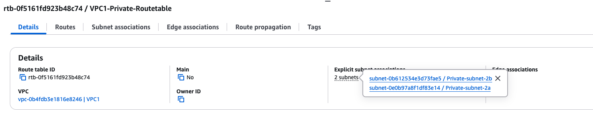

# AWS Networking Assignment: VPC & Secure Network Setup

## Introduction  
This project was about building a **secure, production-style network architecture** in AWS from scratch.  

Instead of just launching EC2 instances with public IPs, I designed a properly segmented **Virtual Private Cloud (VPC)** with:  

- **Public and private subnets** (for isolation).  
- **Controlled internet access** using an **Internet Gateway (IGW)** and a **NAT Gateway (NGW)**.  
- A **Bastion host** for secure administration.
- **CloudWatch monitoring** to log and analyse SSH activity.  

The purpose of this build was to gain hands-on experience in how AWS networking components fit together and to practice enforcing the **principle of least privilege**. On top of the networking, I integrated **observability** through CloudWatch so I could track login activity and better understand how monitoring ties into security.  

---

## ️VPC Architecture Diagram  

  

*This diagram shows the VPC setup: a Bastion host in the public subnet, two private instances (one in each AZ), internet access controlled by IGW/NAT, and CloudWatch monitoring integrated for SSH login events.*  

---

## What I Built (At a Glance)

| Component        | Configuration |
|------------------|--------------|
| **VPC**          | VPC1 – `10.0.0.0/16` |
| **Availability Zones** | `eu-west-2a` and `eu-west-2b` |
| **Subnets**      | Public 2a (with NAT Gateway + Elastic IP) Private 2a (Private Instance A) Public 2b (Bastion host) Private 2b (Private Instance B) |
| **EC2 Instances** | Bastion in Public 2b (public IP) Private Instance A in Private 2a (no public IP) Private Instance B in Private 2b (no public IP) |
| **Routing**      | Public → IGW Private → NAT Gateway |
| **Security**     | Bastion-SG: SSH only from my IP Private-SG: SSH only from Bastion-SG |
| **Monitoring**   | CloudWatch Agent on Bastion Audit logs → Log Group `login-monitoring` Metric filters for SSH login events |

---

##  Step-by-Step Build

### 1. VPC & Subnets
- **Created VPC1** with CIDR block `10.0.0.0/16`.  
- Chose this large block for flexibility — enough IPs for future scaling.  
- Built **two Availability Zones** for fault tolerance: each with 1 public + 1 private subnet.  
- Enabled **auto-assign public IPs** for public subnets (so Bastion/NAT could connect to the internet).  

**Reasoning:** Segregating workloads between public and private subnets enforces least privilege and mirrors production design.  

  
  

---

### 2. Internet & NAT Gateways
- Attached an **Internet Gateway (IGW)** to the VPC → allows inbound/outbound internet traffic for public subnets.  
- Created a **NAT Gateway** in **Public 2a**, assigned an **Elastic IP**.  

**Reasoning:**  
- Public subnets need direct internet access (for Bastion + NAT).  
- Private subnets should not be internet-reachable directly, but still need outbound access (updates, package installs).  
- NAT solves this — private instances can initiate traffic to the internet while staying hidden.  

  
  

---

### 3. Route Tables
- **Public RT**: `0.0.0.0/0 → IGW` (associated with public subnets).  
- **Private RT**: `0.0.0.0/0 → NAT Gateway` (associated with private subnets).  

**Reasoning:** Route tables dictate traffic flow. This setup ensures:  
- Public subnets talk to the internet directly.  
- Private subnets reach the internet only via NAT.  

  
  

---

### 4. Security Groups
- **Bastion-SG**:  
  - Inbound SSH (22) only from *my IP*.  
- **Private-SG**:  
  - Inbound SSH (22) only from Bastion-SG.  

**Reasoning:**  
- Restricting SSH at the source prevents brute force attacks.  
- Private instances are not exposed to the internet at all — only reachable via Bastion.  

  
  

---

### 5. EC2 Instances
- Launched **Bastion (Amazon Linux 2023)** in Public 2b (with public IP).  
- Launched **Private Instance A** in Private 2a (no public IP).  
- Launched **Private Instance B** in Private 2b (no public IP).  

**Validation checks:**  
- SSH → Bastion works from my IP.  
- From Bastion, I can SSH → Private Instances.  
- Private Instances can reach the internet (via NAT Gateway).  

**Reasoning:** This models a secure admin pattern: Bastion is the only way in, while private workloads remain shielded.  

  
  
  

---

### 6. CloudWatch Monitoring & Logging
- Initial plan: monitor “Failed password” attempts (from KodeKloud example).  
- Discovered **Amazon Linux 2023** uses **journald**, not `/var/log/secure`.  
- Also, password authentication is disabled by default → no "Failed password" logs.  

️ **Workaround:**  
- Monitored `/var/log/audit/audit.log` instead.  
- Attached IAM role with `CloudWatchAgentServerPolicy`.  
- Installed CloudWatch Agent on Bastion.  
- Configured agent → stream audit logs into Log Group `login-monitoring`.  
- Created **metric filters**:  
  - `"USER_LOGIN" "res=success"` → `SSHLoginSuccessCount`  
  - `"USER_LOGIN" "res=failed"` → `SSHLoginFailCount`  

**Reasoning:** Monitoring SSH activity gives visibility into login attempts. Even when defaults differ across OS versions, observability can be adapted with audit logs.  

  

---

## What I Learned
- **Networking**: How IGWs, NATs, route tables, and SGs isolate workloads.  
- **Security**: Least privilege in practice (Bastion → private instances only).  
- **Observability**: Using CloudWatch Agent with custom metric filters.  
- **Troubleshooting**: Pivoting when expected logs weren’t there and adapting to journald/auditd.  

---

## Future Improvements
- Deploy **NAT Gateways in both AZs** for high availability.  
- Replace Bastion with **AWS Session Manager** (no SSH keys, audit logs by default).  
- Centralise logging with **cross-account subscriptions**.  
- Add **alarms and dashboards** for real-time SSH monitoring.  

---

**Outcome:** This project gave me hands-on practice with AWS networking, security, and observability — building a secure foundation for cloud infrastructure.  

